# Programação para Internet das Coisas
CURSO: TECNOLOGIA EM SISTEMAS PARA INTERNET

GRUPO: 

 FERNANDA BEATRIZ TAVARES GOMES

 POLIANA DE ARAUJO PEREIRA

TEMA: SERVIÇOS IOT E IMPLEMENTAÇÃO

### Introdução

Devido ao grande número de desperdicios com alimentos (frutas e legumes), que acontece diariamente, buscando formas de reduzir esses dados, seja no ambiente, transporte e até mesmo disponibilizando conhecimento para os transportadores, comerciantes e outros usuários. Como forma de solução a ideia é a criação de um pequeno projeto prático utilizando: Arduino Uno e sensor DHT11 (Umidade e temperatura), leds (amarelo e verde) e entre outro materias. Posteriomente a implementação com o Esp8266, para comunicação com MQTT e exibição desses dados na iterface gráfica para os usuários.

Descrevendo também sobre Serviços IoT que foram estudados, principalmente da Watson IBM e da Azure Microsoft, como eles são utilizados e como podem ser implementados no nosso projeto futuramente.

### Desenvolvimento

Com o objetivo de gerenciar e controlar dados dos produtos (frutas e legumes), a partir da temperatura e umidade do ambiente que estão armazenados, visando reduzir dados de desperdicio. Primeiro fizemos para o arduino em que conseguimos obter os respectivos dados do ambiente, e posteriormente a conexão ao ESP8266 para a comunicação com o broker e o protocolo MQTT para envio desses dados para o Node-RED e o seu dashboard.

Dentre os materiais e métodos para o desenvolvimento, também realizamos pesquisas diversas referente a construção e implementação do dispositivo em arduino, como os componentes utilizados, conexões e códigos; e também sobre o tema a ser desenvolvido, a conservação de frutas e hortaliças, condições que interferem nesses alimentos, dados referentes a temperatura, umidade relativa e ventilação do ar.

#### Implementação do dispositivo (Arduino)

Para a implementação do dispositivos utilizamos: 
- Arduino Uno
- Placa de Ensaio (Protoboard)
- Sensor DHT11 (Umidade e Temperatura)
- Leds (não implementado)
- Servo Motor (não implementado) 
- Resistores (220Ohms e 10 k Ohms)
- Jumpers/fios (macho-macho)
- Cabo USB para Arduino

Na imagem a seguir, temos o dispositivo Arduino Uno que utilizamos e o sensor DHT11, que é a base do nosso projeto, para coleta de dados da temperatura e umidade, tendo uma faixa de temperatura entre 0ºC a 50ºC e de umidade relativa de 20% UR a 90% UR, e a conexão com cabo USB para carregar o programa apartir do computador.

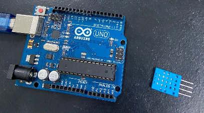

Fizemos a montagem do DHT11 ao Arduino, com o protoboard, um resistor de 10k Ohms. O DHT11 possui 4 pinos, sendo eles: o primeiro (VCC), sendo ligado a alimentação da placa 5V. O segundo é o de dados, que conectamos ao resistor e também ao pino 2 do Arduino. o terceiro (NC) não é utilizado. e o quarto conectado ao terra (GND). Utilizamos o modelo de conexão da imagem a seguir.

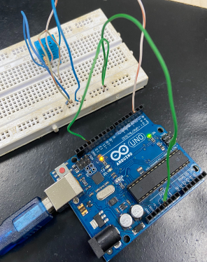
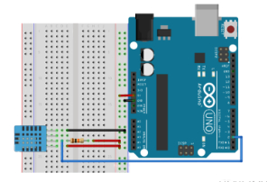

Iniciamos também a inserção dos leds ao projeto, para avisar quando a umidade relativa estiver baixa (led amarelo) e alta (led verde). não conseguimos fazer funciona-los devido ao tempo. Para a conexão dos leds, utilizariamos um resistor de 220Ohms para cada led e fios macho-macho.

Também fariamos a inserção do Servo Motor, para ser utilizado apartir de dados da temperatura para o acionamento de algum dispositivo de refrigeração, ventilador ou ar-condicionado. Para ligar o Servo Motor ao Arduino, temos três pinos, sendo eles: um para alimentação no pino de 5V do Arduino, outro para o terra (GND) e o ultimo para o pino 9 porta digital do Arduino. 

Para a programação do Arduino foi necessário duas bibliotecas para a utilização do sensor: a Biblioteca DHT11 e a AdaFruit. A seguir, temos o código utilizado para a execução do sensor. E Também a saída respectiva do sensor, apresentando a temperatura e umidade do ambiente.

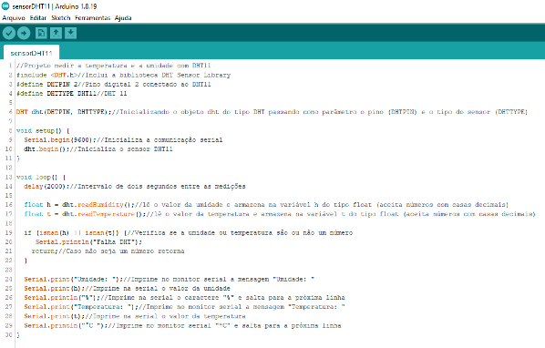
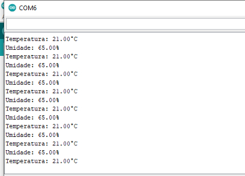

#### Implementação do dispositivo (ESP8266)
Para a implementação do dispositivos utilizamos: 
- ESP8266
- Placa de Ensaio (Protoboard)
- Sensor DHT11 (Umidade e Temperatura)
- Resistores (220Ohms e 10 k Ohms)
- Leds (não implementado)
- Jumpers/fios (macho-macho)
- Cabo USB para ESP8266

Realizamos a montagem do dispositivo no ESP8266 com NodeMCU, e conectando com o sensor DHT11, para obtenção dos dados de Temperatura e Umidade e realizando a conexão com o broker MQTT também, para envio de dados para exibição na interface dashboard do Node-RED, sendo que alguns passos não foram finalizados. Na imagem a seguir temos o ESP8266, com oo DHT e Leds também (mas não foram implementados), o cabo USB para carregamento.

 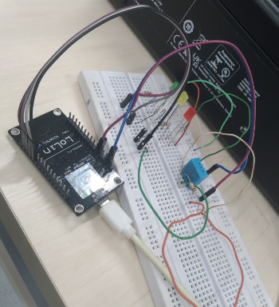
##### Testes de dados do sensor
Para realização de testes também executamos o código no Arduino IDE, para obtenção dos dados do sensor com o ESP8266, o código e a saída foram iguais a realização no dispositivo do Arduino.

##### Comunicação com protocolo MQTT
Já para a utilização do protocolo MQTT, para conexão com wifi e envio de dados para o broker, para posteriormente a comunicação ao Node-RED e a exibição desses dados em uma interface gráfica para os usuários. Também foi necessário a utilização de uma rede wifi para o ESP8266. O comando e saída para o MQTT, estão a seguir. 

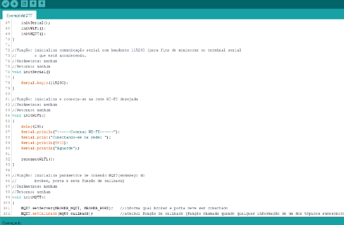
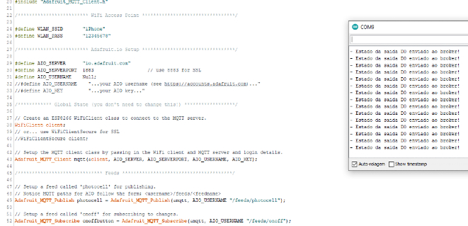

##### Implementação do MQTT para Node-RED
Para a comunicação do MQTT para o Node-RED, unimos os códigos dos dados do sensor e o de conexão do MQTT, inserimos os tópicos, utilizamos o broker do "test.mosquitto.org". Código e saída do terminal abaixo.

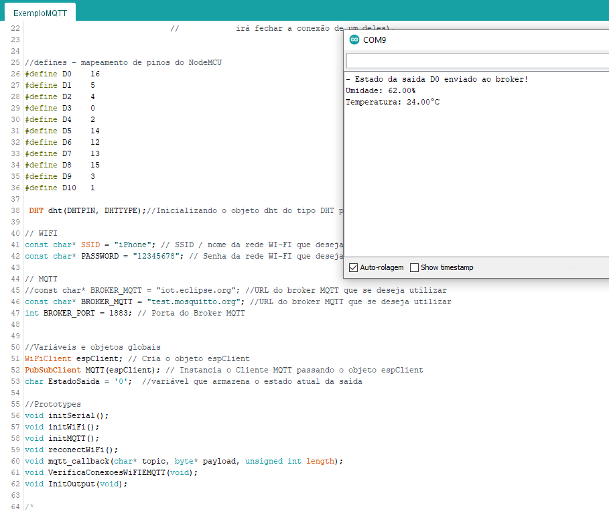
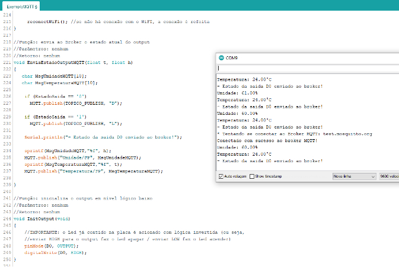

##### Resultado do Dashboard com dados

Após a comunicação do MQTT e envio de dados para o broker, utilizamos o Node-RED no site do Heroku, e no flow adicionamos os nós com o MQTT IN e obtamos por adicionar gráficos gauge, para exibição desses dados de temperatura e umidade. Abaixo temos o flow e o resultado na interface gráfica do dashboard no grupo respectivo, para temperatura e umidade. Futuramente poderá ser incrementado outros critérios, relativos a acionamento de ventilação, sinalização com leds e outros fatores.

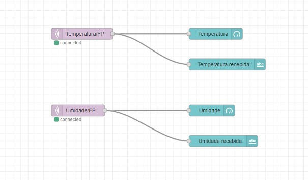
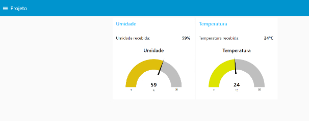

## Aplicação dos Serviços

### WATSON IBM 
A plataforma Watson é a combinação entre a tecnologia de Inteligência Artificial e a linguagem humana para a análise de enormes quantidades de dados e a obtenção rápida de respostas. E é neste ponto que o Watson da IBM entra. Por ser um sistema fundamentado em computação cognitiva, ele é capaz de interpretar esses dados, aprender com eles e criar linhas de raciocínio a partir deles. É por meio desse conceito que diversas indústrias estão se reinventando com o uso do Watson, tais como o varejo, os serviços bancários, a saúde e o setor de viagens, por exemplo. 
Possui diversas ferramentas que são bem completas e servem para ser implementadas por empresas. Baseado na computação cognitiva. Dentre alguns exemplos temos: reconhecimento de imagem, reconhecimento de voz, identificação de usuário, transformação de texto em voz e voz em texto, criação de chatbots e outros.
### Visual Recognition
Esta ferramenta  utiliza de deep learning. Quer dizer que é possível fazer análises de imagens. O serviço utiliza de classes padrão, tornando-o capaz de compreender o conteúdo de alguma imagem e também identifica palavras-chave para descrever a imagem. Também é possível treinar o Visual Recognition com imagens adicionadas pelo usuário e depois ajustar para que seja utilizada em algum domínio específico de aplicação, gerando classificadores personalizados.
#### Utilização
No exemplo de utilização a seguir, foi adicionado o flow do node-RED para a exibição no dashboard, e na imagem a seguir a reprodução em que foi necessário adicionar a imagem a ser analisada e o resultado foi exibido com as palavras-chaves relacionadas a partir da analise.

  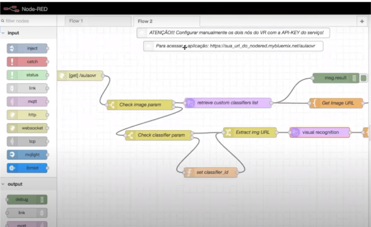
  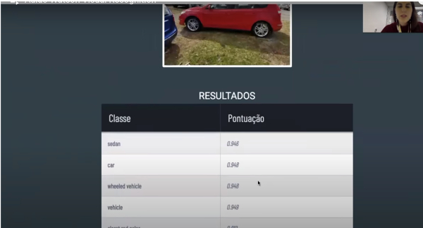
  
#### Implementação com projeto
Esse Serviço de reconhecimento de imagens seria bastante útil na conservação de frutas e legumes, podemos através de imagens dispor de informações para o usuário, send treinado para cada tipo especifico e atribuindo também divisões dos produtos para dicas de ambiente, temperatura adequados. 

### Language Translator
Capaz de traduzir textos entre vários idiomas diferentes e pode ser facilmente inserido em qualquer aplicação. 
#### Utilização
Nesse exemplo com o código em python, utilizamos as credenciais do IBM, e inserimos a linguagem de origem e a que deseja o resultado, seguido do texto que será traduzido. E o seu resultado é obtido na saída do terminal.

  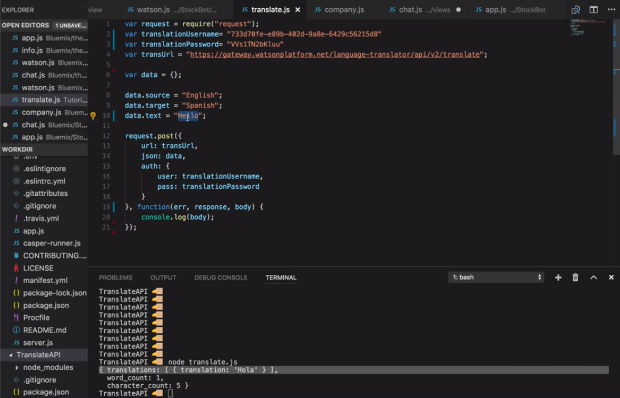

#### Implementação com projeto
Esse Serviço é bastante útil para no caso de tornar as aplicações para serem utilizadas fora do país também, traduzindo os conteúdos em tempo real para a linguagem do usuário, tornando o mais usual e Multi-idiomas.

### AZURE MICROSOFT
A plataforma de nuvem Azure consiste em mais de 200 produtos e serviços de nuvem projetados para ajudar você a dar vida às novas soluções para resolver os desafios atuais e criar o futuro. Crie, execute e gerencie aplicativos em várias nuvens, locais e na borda, com as ferramentas e as estruturas de sua escolha. Azure fornece a funcionalidade do Hub IoT a um preço mais baixo do que se fosse um recurso dedicado usando nossos data centers com mais eficiência. Devido à natureza de recursos compartilhados do serviço, um cliente barulhento “tomando” os recursos pode afetar o desempenho de outro cliente. Se meus dispositivos de IoT (pessoais) estiverem atacando o serviço tentando enviar mensagens cinco vezes por segundo, você poderá descobrir que seus dispositivos também têm dificuldade em se conectar porque o serviço está ocupado tentando lidar com a enxurrada de minhas solicitações de conexão.

#### Utilização
  As propriedades podem ser lidas ou definidas no hub IoT e podem ser usadas para enviar notificações quando uma ação for concluída. Um exemplo de uma propriedade específica em um dispositivo é a temperatura. A temperatura pode ser uma propriedade gravável que pode ser atualizada no dispositivo ou lida de um sensor de temperatura conectado ao dispositivo.O Hub IoT é um recurso compartilhado, o que significa que o Hub IoT que você provisiona é executado no mesmo conjunto de hardware que executa outros hubs IoT. Isso nos permite (Azure) fornecer a funcionalidade do Hub IoT a um preço mais baixo do que se fosse um recurso dedicado usando nossos data centers com mais eficiência. Para habilitar propriedades no Hub IoT usa dispositivos gêmeos ou ‘Plug and Play’. Os dispositivos gêmeos armazenam os metadados específicos do dispositivo na nuvem. Por exemplo, o local de implantação de uma máquina de vendas; Relata informações de estado atual, como recursos disponíveis e condições do aplicativo do dispositivo. Por exemplo, se um dispositivo é conectado ao hub IoT via celular ou Wi-Fi e sincroniza o estado dos fluxos de trabalho de longa execução entre o aplicativo do dispositivo e o aplicativo do back-end.O IoT Plug and Play permite que os criadores de solução integrem dispositivos IoT às suas soluções sem nenhuma configuração manual. No núcleo do IoT Plug and Play há um modelo de dispositivo que um dispositivo usa para anunciar suas funcionalidades a um aplicativo habilitado para IoT Plug and Play.

#### Implementação com projeto
O objetivo é levar os dados para a nuvem primeiro e depois processá-los de acordo com suas necessidades de negócios. Planejamos nossa capacidade em torno do uso pretendido do serviço, em vez do uso de pico no pior caso (também conhecido como, se todos os clientes maximizarem suas unidades exatamente ao mesmo tempo).

### Considerações finais

Buscando através desse projeto prático controlar os produtos e diminuir o desperdício. Emitindo dados do ambiente, relacionados a temperatura e umidade, com o objetivo de coletar esses dados e posteriormente enviar os dados obtidos para o broker MQTT e exibir em um dashboard para acesso dos usuários. Consiste na implementação dos dispositivos em Arduino e ESP8266, com sensor DHT11. Alguns pontos podem ser melhorados, como a implementação com motor servo e leds de sinalização, o envio correto para o MQTT, e a exibição na interface do Node-Red.

Como também é descrito sobre os serviços Iot, e sua utilização e possível implementação com o projeto. E como trabalhos futuros, realizar a implementação dos serviços com o projeto.

#### Referências

Filipe Flop (Brasil). Montagem do sensor DHT11 no arduino. Filipe Flop, 2013.  Disponível em: https://www.filipeflop.com/blog/monitorando-temperatura-e-umidade-com-o-sensor-dht11/#:~:text=Conectando%20o%20sensor%20DHT11%20ao%20Arduino%3A&text=Se%20desejar%2C%20pode%2Dse%20adicionar,e%20o%20pino%20de%20dados.&text=Conecte%20o%20pino%20de%20dados,alterar%20por%20outro%20se%20desejar Acesso em: 02 ago. 2022.

Filipe Flop (Brasil). Monitoramento Iot NodeMCU e MQTT. Filipe Flop, 2016. Disponível em: https://www.filipeflop.com/blog/controle-monitoramento-iot-nodemcu-e-mqtt/ Acesso em: 20 ago. 2022.

IBM WATSON (Brasil). Utilização de serviços, site oficial. IBM. Disponível em: https://cloud.ibm.com Acesso em: 10 ago. 2022.

IFSP (Brasil). Sistema de monitoramento de umidade de solo via web. IFSP, 2021. Disponível em: https://hto.ifsp.edu.br/portal/images/thumbnails/images/IFSP/Cursos/Coord_ADS/Arquivos/TCCs/2018/TCC_HumbertoAntonioFerrisPereira_HT1320203.pdf Acesso em: 29 jul. 2022.

MICROSOFT AZURE (Brasil). INVENTE COM PROPÓSITO: considere suas bases de confiabilidade cobertas. Considere suas bases de confiabilidade cobertas. 2022. Disponível em: https://azure.microsoft.com/pt-br/. Acesso em: 22 jul. 2022.

SBC (Brasil). Sistema IoT para Monitoramento de Temperatura e Umidade Ambientes e Acionamento Remoto de Cargas. SBC, 2020. Disponível em:  https://sol.sbc.org.br/index.php/eripi/article/view/5173/5079 Acesso em: 20 jul. 2022.

Youtube. Aulão Watson Visual Recognition. Disponível em: https://www.youtube.com/watch?v=0GpF39U9iaQ Acesso em: 20 jul. 2022.

Youtube. REST API Tutorial - IBM Watson - Language Translator. Disponível em: https://www.youtube.com/watch?v=amNOs-OT3eA Acesso em: 20 jul. 2022.

